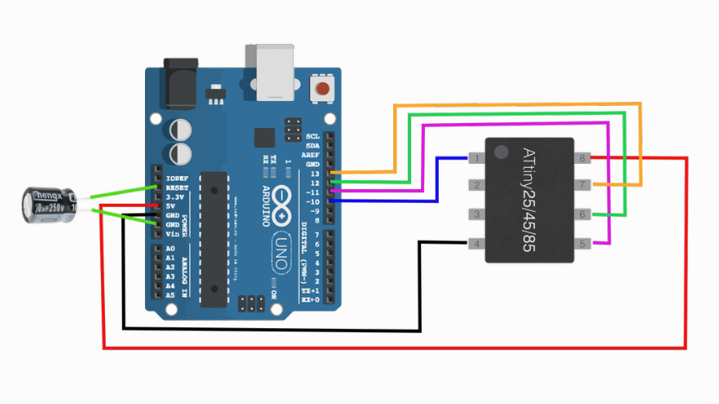

# Attiny85 simple setup for DIY TV-B-Gone
TV-B-Gone Attiny85 tool to ShutDown TVs

- If you found this guide helpful, Please Give me Star on this repository :D

## Setup
- Before you start, check this [go here](readmeTwo.md) file
### what you will need
- Arduino uno (with clone it is slightly dirrerent because it has CH340)
- Attiny85
- Wires
- Breadboard
- IR Transmit diode
- Button (for original script)
- Green LED diode (for original script)
- 10uF capacitor (just for flash code to attiny85)

## Original support EU and US IR codes
- this has 2 options
  - FIRST METHOD --> flash Original [go here](./original/)
  - SECOND METHOD --> flash custom edited [go here](./edited/)

- 10uF capacitor connect (+) to Arduino Uno RESET Pin, and (-) to GND




```
sudo apt install gcc-avr avr-libc avrdude make git binutils-avr libc6-dev
```

- Check ```AVRDUDE``` version
- ```avrdude -v```

## Arduino Uno setup

- connect arduino uno to **WINDOWS** USB port on PC, and upload ArduinoISP code
- then unplug Arduino from USB and connect attiny85 with arduino uno using wires and breadboard
- then connect to **LINUX** PC.

- On Linux PC (or you can use rpi4 with RaspbianOS ...) terminal do this
```
git clone https://github.com/adafruit/TV-B-Gone-kit.git
```
- then navigate using ```cd TV-B-Gone-kit/firmware```
- now is time to change / not change EU and NA IR codes (if you want)
- in this case I will CHANGE from **US** to **EU** in file ```main.c``` and save changes
  - using ```nano main.c``` and  ```press CTRL W``` then type somethingh to search if you want to check out ...
  - **you can find edited files in this repo in folder ```TV-B-Gone-kit/firmware``` for simple flash**

## Flash file to Attiny85
- ! double check wire connection (make sure everything is good) !
- in linux terminal start command
```
make clean
make tvbgone.hex
make program
```
- then check it out, it SHOULD NOT fail, if so, then check whats wrong
- now start command ```ls``` and zou should see more files than in original
- it should be something similar like this:
```
output from ls

IRcaptured  main.h    Makefile             tvbgone.eep  tvbgone.lss  WORLDcodes.c    WORLDcodes.o
main.c      main.lst  Originaltvbgone.hex  tvbgone.elf  tvbgone.map  WORLDcodes.d
main.d      main.o    parsegen3.pl         tvbgone.hex  tvbgone.sym  WORLDcodes.lst
```

- How it should looks like in teminal?
- in my case Raspberry 4
```
make clean
make
make program
This is OUTPUT

-------- begin --------

Cleaning project:
rm -f tvbgone.hex
rm -f tvbgone.eep
rm -f tvbgone.obj
rm -f tvbgone.cof
rm -f tvbgone.elf
rm -f tvbgone.map
rm -f tvbgone.obj
rm -f tvbgone.a90
rm -f tvbgone.sym
rm -f tvbgone.lnk
rm -f tvbgone.lss
rm -f main.o WORLDcodes.o
rm -f  main.lst WORLDcodes.lst
rm -f main.s WORLDcodes.s
rm -f main.d WORLDcodes.d
Errors: none
-------- end --------

set -e; avr-gcc -MM -mmcu=attiny85 -I. -g -Os -funsigned-char -funsigned-bitfields -fpack-struct -fshort-enums -Wall -Wstrict-prototypes -DF_CPU=8000000 -Wa,-adhlns=main.lst  -std=gnu99 -DEU_CODES -DNA_CODES main.c \
| sed 's,\(.*\)\.o[ :]*,\1.o \1.d : ,g' > main.d; \
[ -s main.d ] || rm -f main.d
set -e; avr-gcc -MM -mmcu=attiny85 -I. -g -Os -funsigned-char -funsigned-bitfields -fpack-struct -fshort-enums -Wall -Wstrict-prototypes -DF_CPU=8000000 -Wa,-adhlns=WORLDcodes.lst  -std=gnu99 -DEU_CODES -DNA_CODES WORLDcodes.c \
| sed 's,\(.*\)\.o[ :]*,\1.o \1.d : ,g' > WORLDcodes.d; \
[ -s WORLDcodes.d ] || rm -f WORLDcodes.d

-------- begin --------
avr-gcc (GCC) 14.2.0
Copyright (C) 2024 Free Software Foundation, Inc.
This is free software; see the source for copying conditions.  There is NO
warranty; not even for MERCHANTABILITY or FITNESS FOR A PARTICULAR PURPOSE.


Compiling: main.c
avr-gcc -c -mmcu=attiny85 -I. -g -Os -funsigned-char -funsigned-bitfields -fpack-struct -fshort-enums -Wall -Wstrict-prototypes -DF_CPU=8000000 -Wa,-adhlns=main.lst  -std=gnu99 -DEU_CODES -DNA_CODES main.c -o main.o

Compiling: WORLDcodes.c
avr-gcc -c -mmcu=attiny85 -I. -g -Os -funsigned-char -funsigned-bitfields -fpack-struct -fshort-enums -Wall -Wstrict-prototypes -DF_CPU=8000000 -Wa,-adhlns=WORLDcodes.lst  -std=gnu99 -DEU_CODES -DNA_CODES WORLDcodes.c -o WORLDcodes.o

Linking: tvbgone.elf
avr-gcc -mmcu=attiny85 -I. -g -Os -funsigned-char -funsigned-bitfields -fpack-struct -fshort-enums -Wall -Wstrict-prototypes -DF_CPU=8000000 -Wa,-adhlns=main.o  -std=gnu99 -DEU_CODES -DNA_CODES main.o WORLDcodes.o   --output tvbgone.elf -Wl,-Map=tvbgone.map,--cref -lm

Creating load file for Flash: tvbgone.hex
avr-objcopy -O ihex  -R .eeprom tvbgone.elf tvbgone.hex

Creating load file for EEPROM: tvbgone.eep
avr-objcopy -j .eeprom --set-section-flags=.eeprom="alloc,load" \
--change-section-lma .eeprom=0 -O ihex  tvbgone.elf tvbgone.eep
avr-objcopy: --change-section-lma .eeprom=0x0 never used

Creating Extended Listing: tvbgone.lss
avr-objdump -h -S tvbgone.elf > tvbgone.lss

Creating Symbol Table: tvbgone.sym
avr-nm -n tvbgone.elf > tvbgone.sym
Errors: none
-------- end --------

avrdude -p attiny85 -c arduino  -P /dev/ttyACM0  -b 19200 -U flash:w:tvbgone.hex

avrdude: AVR device initialized and ready to accept instructions
avrdude: device signature = 0x1e930b (probably t85)
avrdude: Note: flash memory has been specified, an erase cycle will be performed.
         To disable this feature, specify the -D option.
avrdude: erasing chip
avrdude: reading input file tvbgone.hex for flash
         with 7838 bytes in 1 section within [0, 0x1e9d]
         using 123 pages and 34 pad bytes
avrdude: writing 7838 bytes flash ...

Writing | ################################################## | 100% 11.13 s

avrdude: 7838 bytes of flash written
avrdude: verifying flash memory against tvbgone.hex

Reading | ################################################## | 100% 5.54 s

avrdude: 7838 bytes of flash verified

avrdude done.  Thank you.


┌──(kali㉿kali-raspberry-pi)-[~/Edited-TV-B-Gone-kit/firmware]
└─$ ls
IRcaptured  main.h    Makefile             tvbgone.eep  tvbgone.lss  WORLDcodes.c    WORLDcodes.o
main.c      main.lst  Originaltvbgone.hex  tvbgone.elf  tvbgone.map  WORLDcodes.d
main.d      main.o    parsegen3.pl         tvbgone.hex  tvbgone.sym  WORLDcodes.lst
```

## Thank you for reading this, I hope it is 100% helpfull guide.

