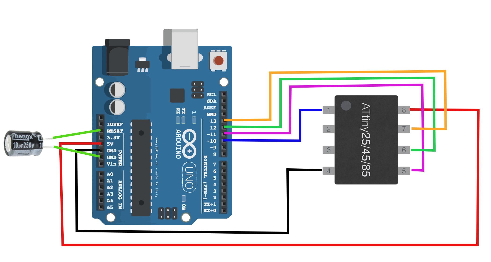

# TV-B-Gone
TV-B-Gone Attiny85 tool to ShutDown TVs

## Setup

### what you will need
- Arduino uno (with clone it is slightly dirrerent because it has CH340)
- Attiny85
- Wires
- Breadboard
- IR Transmit diode
- Button (for original script)
- Green LED diode (for original script)

## Original support EU and US IR codes
- this has 2 options
 - 1. flash Original
 - 2. flash custom edited (like in this tutorial)


```
sudo apt install gcc-avr avr-libc avrdude make git binutils-avr libc6-dev
```

- Check ```AVRDUDE``` version
- ```avrdude -v```

## Arduino Uno setup

- connect arduino uno to **WINDOWS** USB port on PC, and upload ArduinoISP code
- then unplug Arduino from USB and connect attiny85 with arduino uno using wires and breadboard
- then connect to **LINUX** PC.

- On Linux PC (or you can use rpi4 with RaspbianOS ...) terminal do this
```
git clone https://github.com/adafruit/TV-B-Gone-kit.git
```
- then navigate using ```cd TV-B-Gone-kit/firmware```
- now is time to change / not change EU and NA IR codes (if you want)
- in this case I will CHANGE from **US** to **EU** in file ```main.c``` and save changes
  - using ```nano main.c``` and  ```press CTRL W``` then type somethingh to search if you want to check out ...
  - **you can find edited files in this repo in folder ```TV-B-Gone-kit/firmware``` for simple flash**
## Flash file to Attiny85
- ! double check wire connection (make sure everything is good) !
- in linux terminal start command ```make program```
